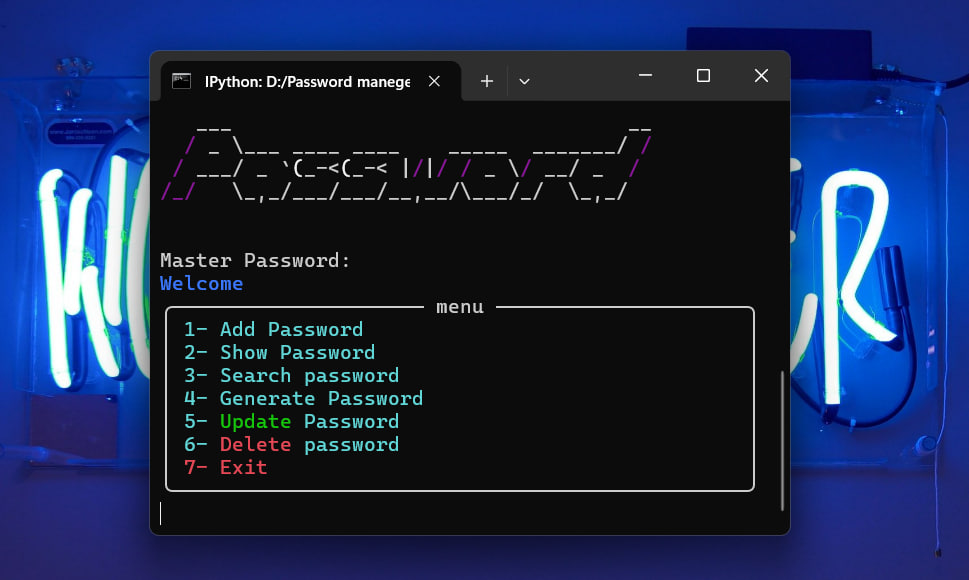
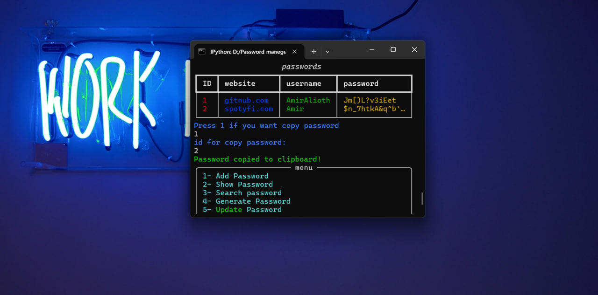
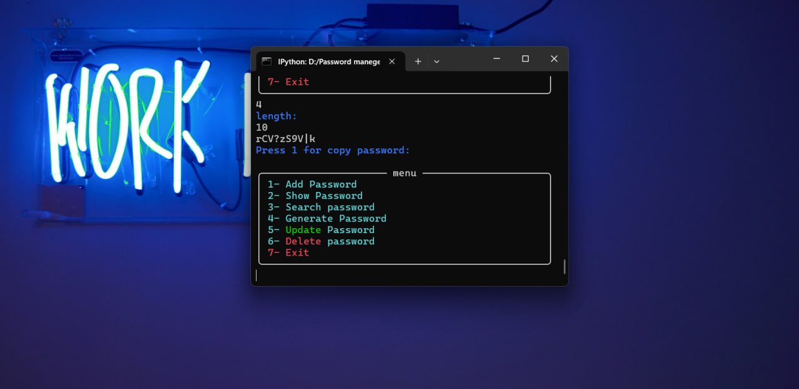

# Password Manager CLI

A simple command-line password manager built with Python.

This project allows you to securely store passwords using SQLite and Fernet encryption. It also includes a master password for authentication and a built-in strong password generator.

## Features

- Add new passwords
- View saved passwords
- Search passwords by website
- Update existing passwords
- Delete passwords
- Generate strong random passwords
- Copy passwords to clipboard
- Master password authentication
- Password encryption using Fernet
- SQLite database

## Technologies

- Python
- SQLite3
- Rich
- PyFiglet
- Cryptography (Fernet)
- Pyperclip

## Screenshots

## Main Menu

<p align="center">
  
</p>

## Password List

<p align="center">
  
</p>

## Password Generation

<p align="center">
  
</p>


```bash
git clone https://github.com/AmirAlioth/PasswordManager
```

Install the requirements:

```bash
pip install -r requirements.txt
```

Generate the encryption key:

```bash
python generate_key.py
```

Run the application:

```bash
python start.py
```

## Project Structure

```
Password-Manager/
│
├── auth.py
├── database.py
├── encryption.py
├── menu.py
├── start.py
├── ui.py
├── generate_key.py
├── requirements.txt
└── README.md
```

## License

MIT License